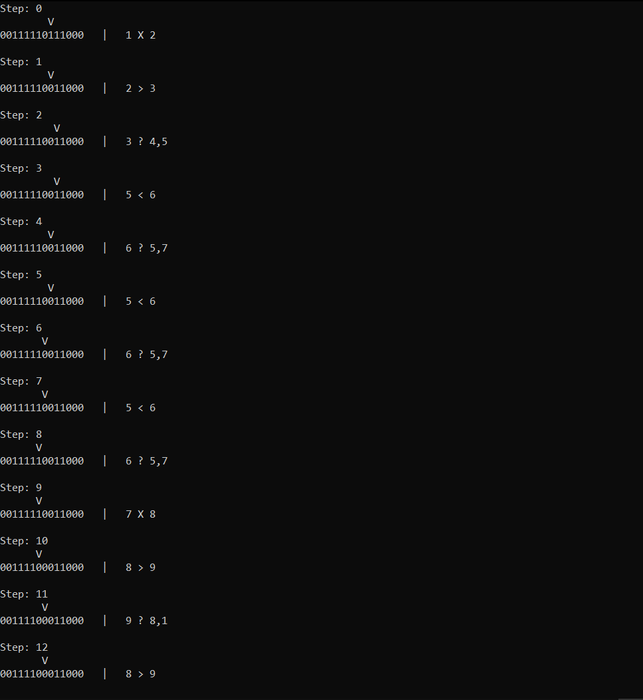
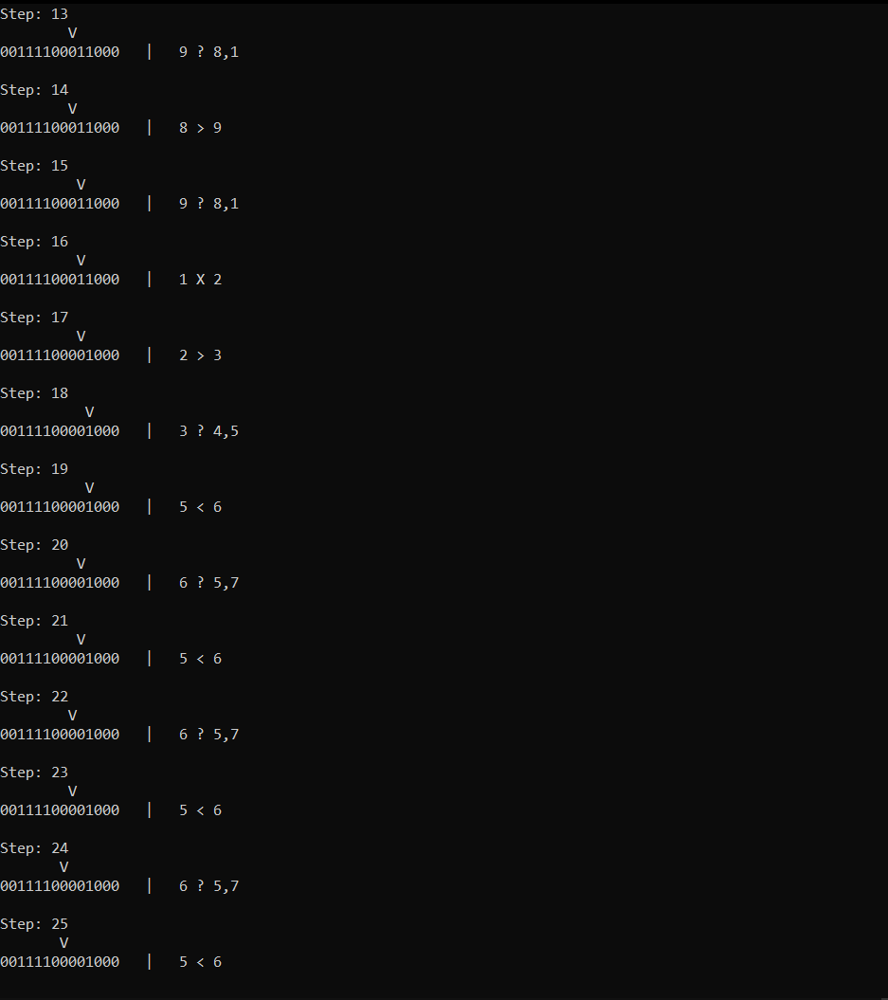
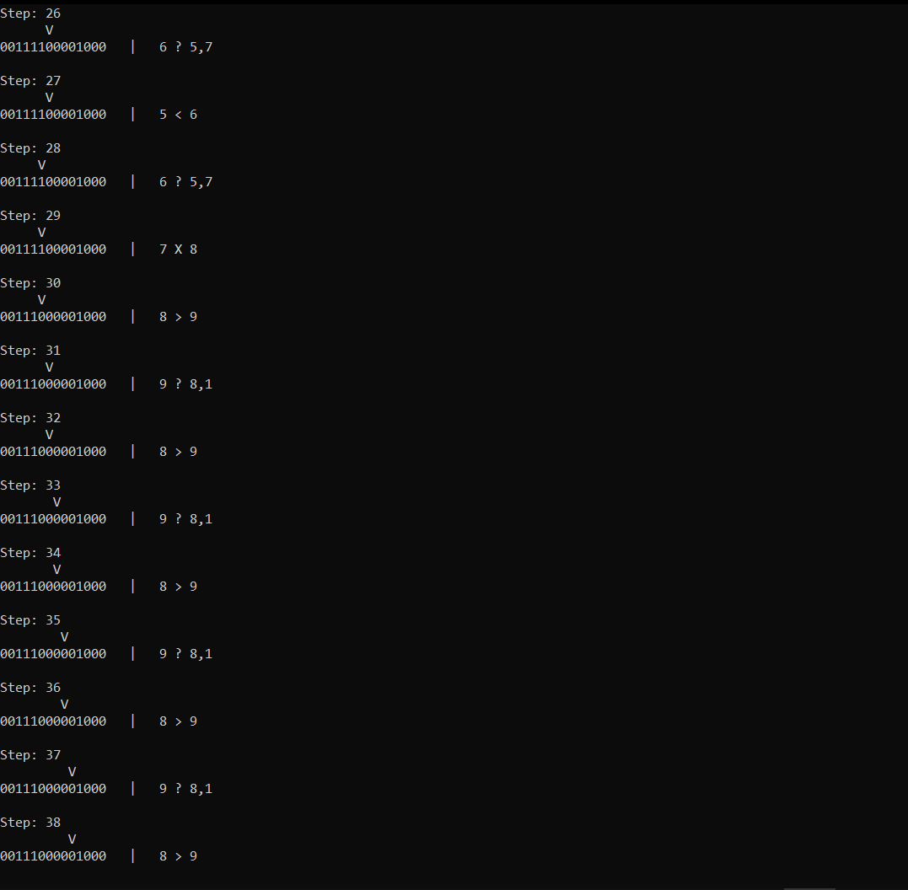
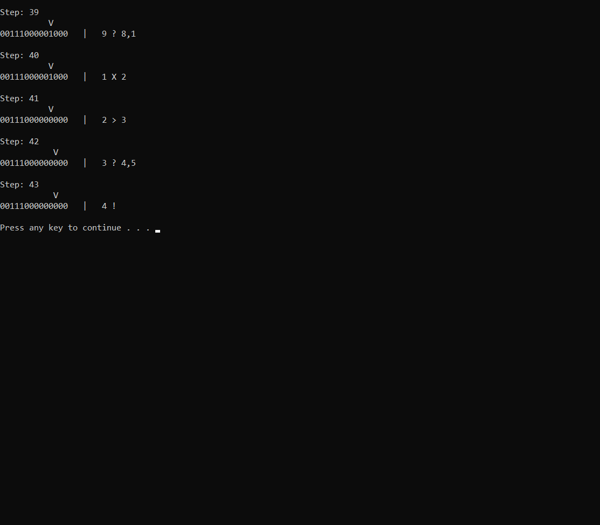

# Description

Creating abstract class - **Post machine**

# Running

By default the program counts the difference between two numbers. You can set the condition in the program code.

# Screenshots

# Conclusion

To solve this task I use Microsoft VisualStudio 2019 and C++ language.